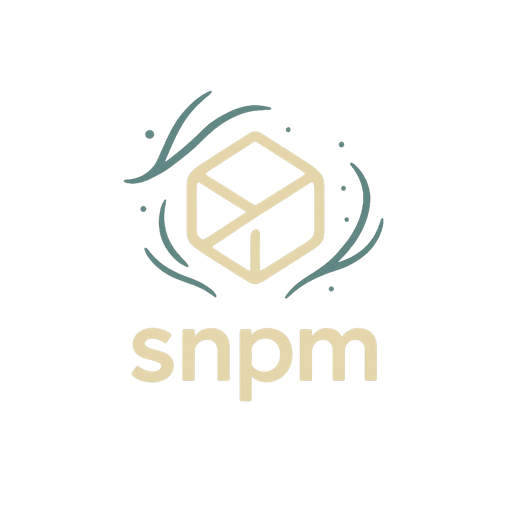

<div align="center">
  
  <h1>snpm</h1>
  <p><strong>Speedy Node Package Manager</strong></p>
</div>

> **Status:** functional WIP. It installs, it runs, it's fast. But it's still young.

`snpm` is a drop-in replacement for npm, yarn, and pnpm. It is written in Rust with a strict "no cleverness" rule.

We aren't trying to invent a new workflow. We just want the existing one—installing deps, working in monorepos, running scripts—to be faster, simpler, and easier to maintain.

## The Vision

We want a tool that:
- **Feels Familiar**: `snpm install`, `snpm add`, `snpm run`. No new muscle memory required.
- **Is Fast by Default**: Global caching, parallel downloads, and smart reuse.
- **Is Deterministic**: A simple, readable lockfile (`snpm-lock.yaml`) that guarantees the same install everywhere.
- **Is Readable**: The codebase is designed to be understood by mid-level Rust devs. No premature abstractions or complex type magic.

## Features

Here is what works today:

- **Core Commands**: `install`, `add`, `remove`, and `run` are fully functional.
- **Global Store**: We download packages once to a global cache and reuse them across projects.
- **Parallelism**: Network and disk operations happen in parallel where safe.
- **Workspaces**: First-class monorepo support. We detect `snpm-workspace.yaml` (or `pnpm-workspace.yaml`) and install dependencies for all projects in the workspace efficiently.
- **Catalog Protocol**: Define versions in one place (`snpm-catalog.yaml`) and reference them across your workspace. No more version drift between packages.
- **Minimum Version Age**: A unique safety feature. You can configure `snpm` to ignore versions published within the last $N$ days. This protects you from "zero-day" malicious packages or broken releases.
- **Lockfile**: We read and write a clean YAML lockfile to keep your dependency tree stable.

## Usage

To build and install from source:

```bash
cargo install --path snpm-cli
```

Then use it just like npm:

```bash
snpm install
snpm add react
snpm run build
```

## Roadmap

We are actively working on:
- **First-class Workspaces**: Better resolution for local packages within a monorepo.
- **CI Support**: Frozen lockfiles and immutable installs.
- **Optimizations**: Smarter linking strategies to save even more disk space.

This project is open for contribution. If you like Rust and hate waiting for `npm install`, take a look at the code.
