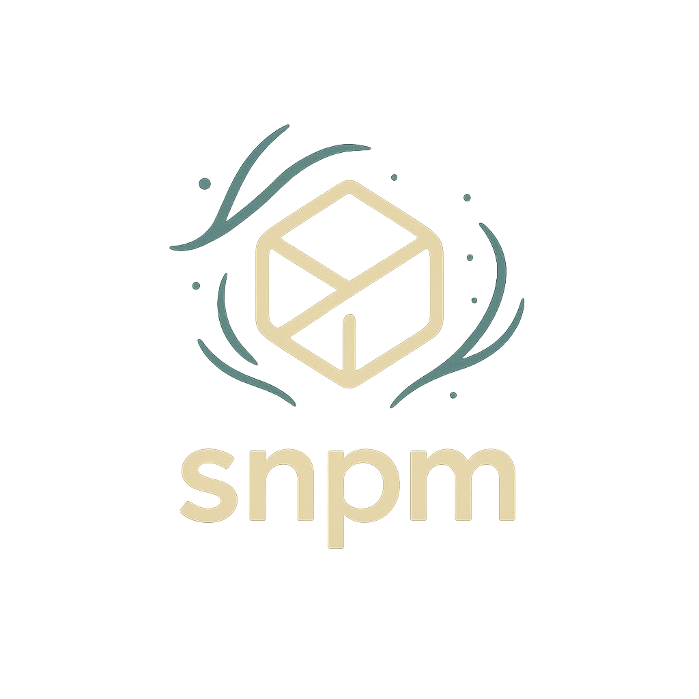

<div align="center">
  

  <p>
    <strong>A Rust-native package manager for JavaScript workspaces.</strong>
  </p>

  <p>
    <a href="https://www.npmjs.com/package/snpm"></a>
    <a href="https://github.com/binbandit/snpm/releases"></a>
    <a href="https://github.com/binbandit/snpm/blob/main/LICENSE-MIT"></a>
  </p>

  <p>
    <a href="https://snpm.io">Documentation</a> · <a href="https://github.com/binbandit/snpm/releases">Releases</a> · <a href="https://github.com/binbandit/snpm/issues">Issues</a>
  </p>
</div>

## What is snpm?

`snpm` is a package manager for Node.js projects, written in Rust and shaped around pnpm-style workflows: a shared package store, a `node_modules/.snpm` virtual store, workspace-aware installs, and a lockfile-first install path.

It is compatibility-focused, but it is not claiming perfect drop-in parity yet. The native lockfile is `snpm-lock.yaml`. When that file is not present, `snpm` can import supported lockfiles from pnpm, Bun, Yarn, and npm, then continue with its own lockfile.

The project is under active development. The core install, workspace, registry, cache, script-policy, and package workflow surfaces are in place; ecosystem edge cases and full CLI parity are still being hammered into shape.

## Current State

The repository currently includes:

- `snpm`, the primary CLI in `snpm-cli`
- `snpm-core`, the install engine, resolver, linker, registry/auth layer, workspace logic, lifecycle policy, lockfile handling, and package operations
- `snpm-semver`, npm-compatible semver parsing and constraint matching
- `snpm-switch`, a launcher that can honor a project's pinned `packageManager` version
- `benchmarks/`, a hermetic package-manager benchmark harness
- `compat-lab/`, a repeatable compatibility lab for real JS/TS repositories
- `skills/snpm`, an installable agent skill for AI coding agents

What works today:

- Project and workspace installs with `snpm-lock.yaml`
- Add/remove/upgrade/outdated/list flows, including global installs
- Workspace discovery from `snpm-workspace.yaml`, `pnpm-workspace.yaml`, and `package.json` workspaces
- Workspace selectors through `-r`, `--filter`, and `--filter-prod`
- Catalogs and overrides through `snpm-catalog.yaml`, `snpm-overrides.yaml`, workspace config, and compatible catalog sources
- Import of compatible `pnpm-lock.yaml`, branch pnpm lockfiles, `bun.lock`, `yarn.lock`, `npm-shrinkwrap.json`, and `package-lock.json`
- Registry auth, scoped registries, `.snpmrc` / `.npmrc` / `.pnpmrc`, and token environment variables
- Dependency lifecycle scripts blocked by default, with explicit allowlists
- `run`, `exec`, and script-name fallback with lazy install checks
- `dlx` / `spx` one-off package execution
- `audit`, `why`, `licenses`, `patch`, `pack`, `publish`, `rebuild`, `link`, `unlink`, `store`, `clean`, `login`, `logout`, and `config`
- npm, JSR, `file:`, and git package sources

Still evolving:

- Exact pnpm behavior across every CLI edge case
- Compatibility with unusual package layouts and lifecycle expectations
- Performance tuning across larger real-world repositories
- Polish around diagnostics, docs, and migration guidance

## Install

Install from npm:

```bash
npm install -g snpm
```

The npm package installs native binaries for supported platforms and exposes:

- `snpm` for normal package-manager commands
- `spx` as shorthand for `snpm dlx`

Or install from this repository:

```bash
cargo install --path snpm-cli --force
cargo install --path snpm-switch --force
```

You can also download binaries from [GitHub Releases](https://github.com/binbandit/snpm/releases).

## Quick Start

```bash
snpm install
snpm add react
snpm add -D typescript
snpm remove left-pad
snpm run build
snpm exec eslint .
snpm dlx cowsay "hello"
```

In a workspace:

```bash
snpm install
snpm install -w @acme/api
snpm run build -r
snpm run test --filter "@acme/*"
snpm run test --filter api...
snpm add -r -D vitest
```

In CI:

```bash
snpm install --frozen-lockfile
snpm install --production --frozen-lockfile
SNPM_MIN_PACKAGE_AGE_DAYS=7 snpm install --frozen-lockfile
```

## Lockfiles and Compatibility

`snpm` writes `snpm-lock.yaml` and uses `node_modules/.snpm-integrity` markers to skip work when the lockfile-derived install state is already present.

If `snpm-lock.yaml` is missing, installs can seed from compatible lockfiles:

- pnpm: `pnpm-lock.yaml` and branch lockfiles such as `pnpm-lock.feature!name.yaml`
- Bun: `bun.lock`
- Yarn: `yarn.lock`
- npm: `npm-shrinkwrap.json` and `package-lock.json`

Imported lockfiles are used as compatibility input; `snpm-lock.yaml` is the native source of truth after migration.

## Command Surface

| Area | Commands |
| --- | --- |
| Install and dependency edits | `install`, `add`, `remove`, `upgrade`, `outdated`, `list` |
| Scripts and binaries | `run`, `exec`, `dlx`, script-name fallback, `spx` |
| Workspaces | `install -w <name>`, `-r`, `--filter`, `--filter-prod` |
| Registry and release | `login`, `logout`, `config`, `pack`, `publish` |
| Inspection and security | `audit`, `why`, `licenses` |
| Maintenance | `store status`, `store prune`, `store path`, `clean`, `rebuild` |
| Local development | `link`, `unlink`, `patch edit`, `patch commit`, `patch remove`, `patch list`, `init` |

Useful global flags:

```bash
snpm --frozen-lockfile install
snpm --prefer-frozen-lockfile install
snpm --no-frozen-lockfile install
snpm --verbose install
```

## Workspaces

Workspace discovery supports:

- `snpm-workspace.yaml`
- `pnpm-workspace.yaml`
- `package.json` `workspaces`

Workspace config supports package globs, default and named catalogs, `onlyBuiltDependencies`, `ignoredBuiltDependencies`, optional hoisting configuration, and global virtual-store exclusions for selected packages.

Selector examples:

```bash
snpm run test -r
snpm run test --filter @acme/api
snpm run test --filter "@acme/*"
snpm run test --filter ./packages/api
snpm run test --filter api...
snpm run test --filter ...api
snpm run test --filter "[origin/main]"
snpm run test --filter "!@acme/docs"
```

The same selector model is shared by workspace-aware commands such as `add`, `remove`, `upgrade`, `outdated`, `list`, `why`, and `publish`.

## Script Policy

Dependency lifecycle scripts are blocked by default. This is intentional: native addons and tool packages can still be allowed, but they need to be named explicitly.

```bash
SNPM_ALLOW_SCRIPTS=esbuild,sharp snpm install
```

Workspace config can also allow or ignore build scripts:

```yaml
onlyBuiltDependencies:
  - esbuild
  - sharp
ignoredBuiltDependencies:
  - fsevents
```

Root project lifecycle scripts still run for normal install script stages. Use `snpm rebuild` after changing script policy for already-installed packages.

## Configuration

`SnpmConfig::from_env()` resolves configuration from environment variables and rc files. `snpm` reads `.snpmrc`, `.npmrc`, and `.pnpmrc` from home and ancestor directories, with later files overriding earlier values.

Common environment variables:

- `SNPM_HOME` to choose the cache/data root
- `SNPM_ALLOW_SCRIPTS` for dependency lifecycle allowlists
- `SNPM_MIN_PACKAGE_AGE_DAYS` and `SNPM_MIN_PACKAGE_CACHE_AGE_DAYS`
- `SNPM_HOIST`, `SNPM_LINK_BACKEND`, `SNPM_STRICT_PEERS`, `SNPM_FROZEN_LOCKFILE`
- `SNPM_REGISTRY_CONCURRENCY`, `SNPM_VERBOSE`, `SNPM_LOG_FILE`
- `NPM_CONFIG_REGISTRY`, `NODE_AUTH_TOKEN`, `NPM_TOKEN`, `SNPM_AUTH_TOKEN`

Inspect the resolved configuration with:

```bash
snpm config
```

## Version Switching

The npm shim prefers `snpm-switch` when it is installed. `snpm-switch` can read a project's `packageManager` field, download/cache the requested `snpm` version, and run the matching binary.

```json
{
  "packageManager": "snpm@2026.4.23"
}
```

Helpful commands:

```bash
snpm switch which
snpm switch cache
snpm switch list
snpm --switch-version 2026.4.23 install
snpm --switch-ignore-package-manager install
```

When using the standalone launcher binary directly, use `snpm-switch` in place of the npm-shimmed `snpm`.

## Repository Layout

| Path | Purpose |
| --- | --- |
| `snpm-cli/` | Clap CLI, command dispatch, console UX, multicall aliases |
| `snpm-core/` | Resolver, registry, store, linker, lockfile, lifecycle, workspace, and operation logic |
| `snpm-semver/` | npm-compatible semver parser and range matching |
| `snpm-switch/` | Version-aware launcher for pinned `packageManager` projects |
| `npm-package/` | npm package wrapper and native-binary installer |
| `benchmarks/` | Hyperfine benchmark scenarios against other package managers |
| `compat-lab/` | Real-repository compatibility harness |
| `docs/` and `docs-site/` | Design notes, logo, and documentation site |
| `skills/snpm/` | Agent skill with command/config references |

## Development

```bash
cargo build --workspace
cargo test --workspace
cargo fmt --all
cargo clippy --all-targets --all-features
```

Install the local CLI while developing:

```bash
cargo install --path snpm-cli --force
```

Run benchmark and compatibility smoke checks:

```bash
just bench
./compat-lab/run.sh --limit 5
```

See [CONTRIBUTING.md](CONTRIBUTING.md) for the contribution guide.

## Agent Skill

This repo ships an installable [agent skill](https://github.com/anthropics/skills) at `skills/snpm` that teaches AI coding agents how to use `snpm`.

```bash
npx skills add https://github.com/binbandit/snpm --skill snpm
npx skills add https://github.com/binbandit/snpm --skill snpm -g
npx skills add https://github.com/binbandit/snpm --skill snpm -a cursor
```

## License

MIT OR Apache-2.0
